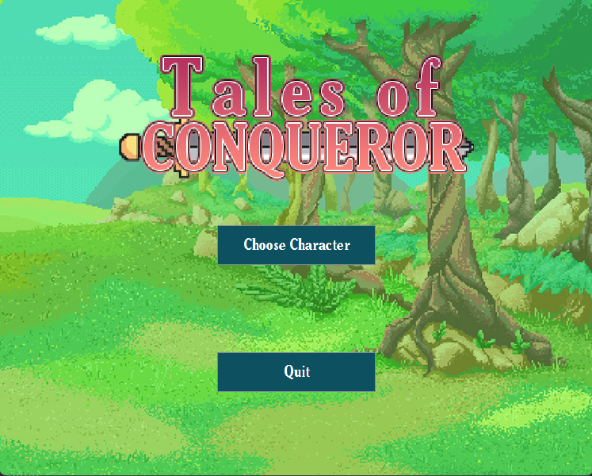
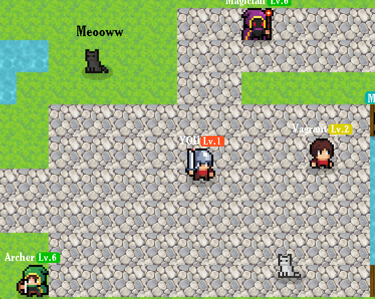
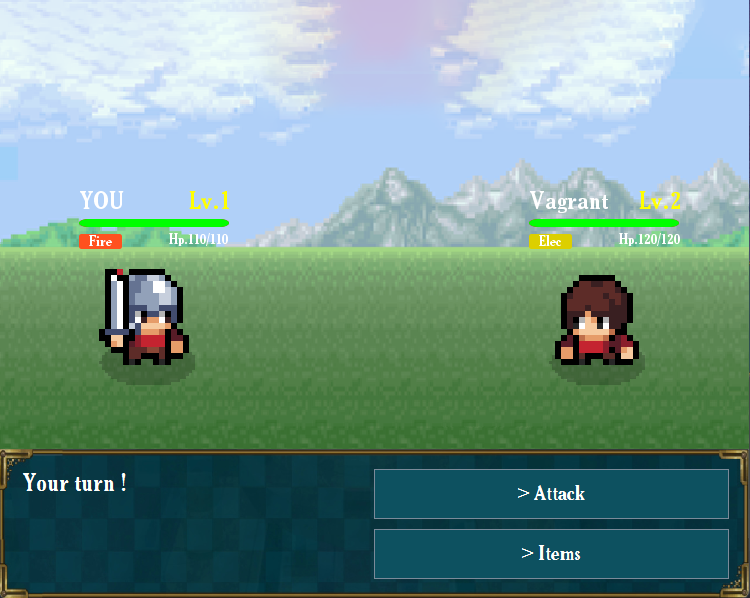

# Tales of Conqueror (T-JAV-501) ⚔️

## Introduction 📖
This project aims to realise a 2D Game to put our OOP principles into practice.
We can move our game in any direction we want.  

We wanted to make a RPG game, and we got inspired by several games:
- Tales of Symphonia 2003 (for menus, music and sound effects)
- Secret of Mana 1993 (for map movement)
- Final Fantasy (for turn-based combat)

To make the game possible, we needed to realise the following steps :
- Create a gameloop (with a fixed timestep -> 60fps)
- Create a map with a camera and tiles
- Create a player and npc with animations
- Create a combat system
- Create a menu system

The game has been created with Javaswing and must respect the MVC architecture as much as possible.

## Screenshots 📸
 Display of our main menu 'Tales of Conqueror'. 

 Display of our character selection menu. 

 Display of our fight panel. 

 Display of our fight panel. 

## Technologies 💯

The technologies used on our project are :
- JavaSwing

## Contributors 💪
**- Nathan DULAC**  
- [Github](https://github.com/Torahime3)
- [Linkedin](https://www.linkedin.com/in/nathan-dulac-2aa654257/) 

**- Victor MORELLET**  
- [Github](https://github.com/Yolann29)
- [Linkedin](https://www.linkedin.com/in/victor-morellet-bb6110266/) 

## Trello 💼
**[Trello Tales of Conqueror]https://trello.com/b/kFx1QKts/t-jav-501)**